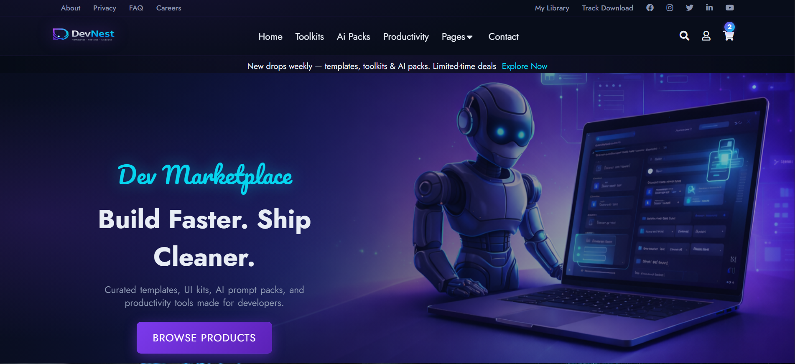

  

# DevNest Marketplace

A modern marketplace-style frontend project built with **HTML5** and **CSS3** to showcase digital developer products in a clean and structured interface.

## Live Demo
[View Project](https://abd-eid.github.io/devnest-marketplace/#)

## Overview
DevNest Marketplace is a frontend practice project focused on applying **HTML5** and **CSS3** to a realistic multi-section website layout.

The project includes several common UI sections found in modern marketplace websites, such as product categories, trending items, articles, and newsletter subscription.

## What I Practiced
- Semantic HTML5 structure
- CSS3 styling and layout
- Section organization
- Card-based UI design
- Visual hierarchy and spacing

## Sections Included
- Hero section
- Categories section
- Trending products
- Articles
- Newsletter
- Footer

## Tech Stack
- HTML5
- CSS3

## Future Improvements
- Responsive design
- Better accessibility
- JavaScript-based interactivity
- More polished animations

## Author
**Abd Eid**
